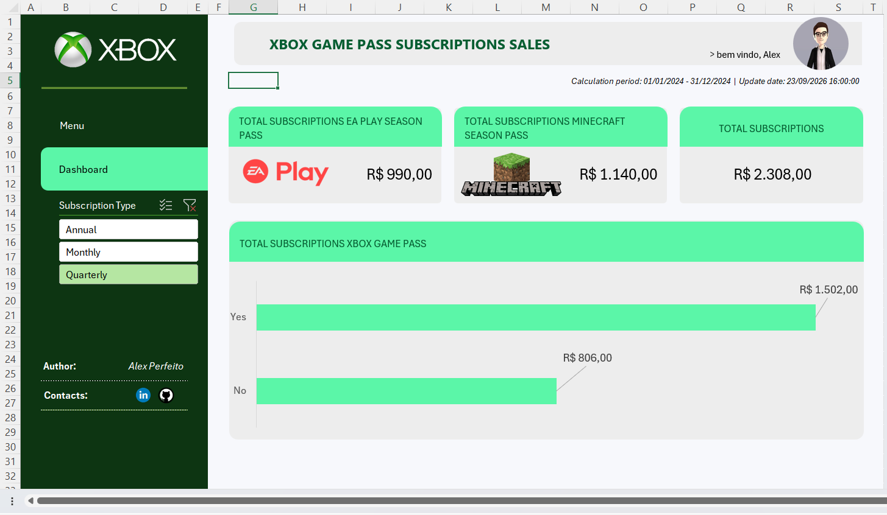

# 🎮 Dashboard de Vendas do Xbox com Excel

Dashboard desenvolvido em Microsoft Excel como parte de um desafio da **DIO (Digital Innovation One)**, com o objetivo de transformar dados de vendas de assinaturas em informações visuais para facilitar a análise dos resultados.

## 📊 Sobre o Projeto

O projeto consiste na criação de um dashboard para análise das vendas de assinaturas relacionadas ao Xbox Game Pass.

A solução foi desenvolvida utilizando recursos do Microsoft Excel para organizar, consolidar e apresentar os dados de forma visual e interativa.

O dashboard permite acompanhar informações como:

- Total de assinaturas;
- Total de assinaturas EA Play Season Pass;
- Total de assinaturas Minecraft Season Pass;
- Comparação entre assinaturas;
- Filtro por tipo de assinatura;
- Visualização gráfica dos resultados.

---

## 🎯 Objetivo

O objetivo deste projeto é transformar dados brutos de vendas em informações visuais que facilitem a interpretação dos resultados.

A construção do dashboard também teve como foco a aplicação prática de conceitos de:

- Organização e tratamento de dados;
- Tabelas e filtros;
- Indicadores de desempenho;
- Gráficos;
- Visualização de dados;
- Construção de dashboards no Excel.

---

## 🛠️ Ferramentas Utilizadas

- **Microsoft Excel**
- Tabelas e filtros
- Gráficos
- Indicadores/KPIs
- Formatação e organização visual

---

## 📈 Dashboard

---

## 🎛️ Filtros

Foi utilizado um filtro de **Subscription Type**, permitindo visualizar os dados de acordo com o tipo de assinatura:

- Annual
- Monthly
- Quarterly

Essa funcionalidade facilita a exploração dos dados e permite observar diferentes perspectivas das informações apresentadas.

---

## 📅 Período dos Dados

**Período de cálculo:** 01/01/2024 a 31/12/2024

**Data de atualização:** 23/09/2026

---

## 📚 Desafio DIO

Este projeto foi desenvolvido como parte de um desafio de projeto da **DIO - Digital Innovation One**, com foco na criação de um dashboard de vendas utilizando o Microsoft Excel.

A proposta do desafio é trabalhar a organização dos dados e sua transformação em informações visuais úteis para análise.

---

## 📁 Arquivos do Projeto

| Arquivo | Descrição |
|---|---|
| `dashboard_xbox.xlsx` | Arquivo Excel contendo o dashboard |
| `images/dashboard.png` | Imagem de visualização do dashboard |

---

## 👤 Autor

Desenvolvido por **Alex Perfeito**.

